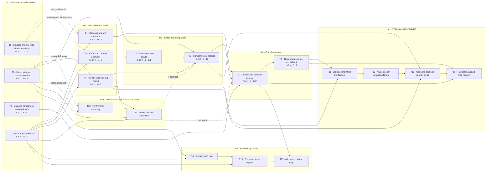

# Bla Bla Walk roadmap

This roadmap visualizes the tasks in [the build plan](docs/plan.md). [Pick a task and start](TASK_START.md) gives each slot a copyable prompt and model setting. Effort and duration are **rough planning estimates in focused person-hours**, since the plan does not yet estimate task time. Re-estimate after the source and geometry feasibility checks. Calendar dates are omitted because task owners and available build hours are not set.

## Tasks, effort, and sequence

**Completed and merged:** ~~T0~~, ~~T1~~, ~~T2~~, ~~T3~~, ~~T4~~ and ~~T9~~. Their task labels stay visible in the chart and plan.

**After the core demo:** M4 phone access is the first extension, followed by M5 shared reports. These tasks are not included in the 48–83 hour core estimate. Live telephony, actual map delivery, and volunteer accompaniment need a later re-plan.

The conditional transit proposal uses T18/T19; these tasks also remain outside the core effort estimate. Walking comparison stays usable if transit sources are not admitted. Offline transit needs saved timetable/candidate evidence or an explicit unavailable state, as defined in T6.

**Effort key:** S = 1–2 h, M = 3–6 h, L = 5+ h; task-specific hour ranges are shown on each card. Dashed arrows mean the plan calls for relevant T0 data checks, rather than making all source research a blanket prerequisite.

## Estimated development time

These are original total-effort estimates, including completed work; they are not remaining hours. T8 ingestion and provider/offline modes are already merged.

| Roadmap stage | Tasks | Estimated team effort | Dependencies / overlap |
|---|---|---:|---|
| Preparation and foundation | T0, T1, T2, T3 | 15–25 h total | Can run in parallel across the team; T1 has no task prerequisite. |
| Data and route layers | T4, T8, T9 | 14–24 h total | Start after T1 and the relevant T0 or T2 inputs; tasks can run in parallel. |
| Shade and comparison | T10, T5 | 13–24 h total | T10 follows T8; T5 also needs T9 and T2. |
| Complete demo | T6, T7 | 6–10 h total | T6 follows T4, T5, and T3; T7 follows T6. |
| **Core plan** | **T0–T10** | **48–83 h total** | **About 33–58 focused hours on the critical path if parallel tasks have owners.** |

The critical-path estimate is elapsed focused team time with enough contributors to overlap the independent preparation and layer tasks; it is not a calendar promise. With one person doing tasks serially, allow roughly **48–83 focused hours**. The largest uncertainty is whether city-wide geometry preparation and time-dependent shade meet the coverage, performance, and memory checks in T0, T8, and T10.

## Proposed split for six contributors

These are role slots, not assigned people. Replace A–F with contributors' GitHub usernames in [TEAM.md](TEAM.md) after the team chooses who wants each area; until then, ownership remains unassigned in the build plan. Estimates below divide the work already counted above, including shared implementation of T6 and T10.

| Slot | Work and task ownership | Primary files | Estimated effort |
|---|---|---|---:|
| **A · Sources and observations** | T0 source and city-wide feasibility; T4 temperature and fountain adapters | `docs/SOURCES.md`, `data/source-manifest.json`, `data/tile-inventory.json`, observation adapters, fixtures, and tests | 9–15 h |
| **B · Domain rules and evaluation** | T2 demo walk, cases, and comparison rules; T5 route metrics and explanation | `docs/routing-rules.md`, `data/scenarios.json`, `backend/bla_bla_walk/evaluation.py`, `config/routing-rules.json`, evaluation tests | 8–13 h |
| **C · Map design and walking routes** | T3 screen design; T9 checked route alternatives | `docs/style-guide.md`, `backend/bla_bla_walk/adapters/routes.py`, `data/routes/demo.geojson`, route tests | 5–9 h |
| **D · Map foundation and screen** | T1 runnable foundation; screen portion of T6 | Python/browser asset setup, `src/map.js`, `src/main.js`, comparison screen, `src/theme.css`, generated client declarations/schema, API and browser checks | 7–11 h |
| **E · Geometry and shade calculation** | T8 reusable city geometry; calculation portion of T10 | `backend/bla_bla_walk/geometry.py`, `backend/bla_bla_walk/shade.py`, `scripts/prepare_geometry.py`, `config/geometry.json`, geometry/shade tests and preparation evidence | 12–22 h |
| **F · Integration and demo** | Cache/API and performance portion of T10; end-to-end wiring and journey checks in T6; T7 demo and fallback | `backend/bla_bla_walk/shade_cache.py`, `backend/bla_bla_walk/snapshots.py`, offline basemap preparation/verification scripts, API/UI wiring, journey checks, `README.md`, `docs/demo.md` | 7–13 h |

### One repository, parallel work

- Keep one shared GitHub repository. Each contributor uses their own clone and a short-lived task branch named for the work, then opens a pull request. Never have several people edit the same working folder.
- T0, T1, T2, T3, T4 and T9 are merged. Continue T8 spatial/scene/bridge acceptance using the prepared geometry, then T10, T5, T6 and T7 in dependency order. T18/T19 remain conditional proposals; do not repeat completed preparation tasks.
- Keep file ownership with the slot above. D and F share T6 in sequence: D builds the comparison screen; after that is ready, F connects the API and checks the whole journey. E and F share T10 in sequence: E produces geometry and shade calculations; F adds caching, API connection, and performance checks.
- Before beginning a dependent task, sync with its owner and use the merged branch as the base. If a change needs another slot's files, agree on the handoff first. Keep `main` runnable.
- Review every pull request with at least one teammate. Run the repository privacy guard before commit and push. Merge only after explicit approval from the user who owns that pull request.
- Meet periodically to report what's ready, what's next, blockers, and any file overlap. Keep the demo story and offline fallback together under F's ownership.

## Suggested checkpoints

1. **Foundation runs:** T1 starts the Basel map with labelled fixtures and visible missing/stale states.
2. **Feasibility holds:** T0 confirms the source and city-wide geometry approach; T2 settles the example walk and comparison rules.
3. **Two alternatives compare:** T4, T8–T10, T9, and T5 supply observations, shade, routes, and explained comparisons.
4. **Demo is repeatable:** T6 connects the journey; T7 prepares the three-minute story and dated offline fallback.
